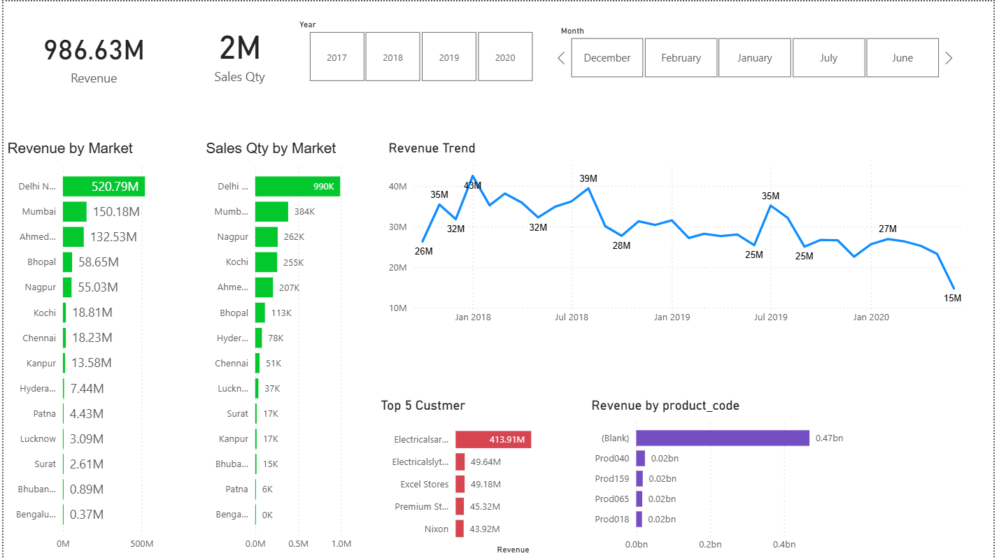

# Sales Performance Dashboard (Power BI & MySQL)

This project shows how to build a business dashboard using Power BI with data stored in a MySQL database. It includes basic SQL exploration, data cleaning using Power Query, and creating interactive visuals to analyze sales performance. The aim is to demonstrate how raw database data can be converted into useful business insights.

## Project overview

Tools used: Power BI and MySQL  
Project type: Business intelligence and data visualization  

The dataset was provided as a SQL dump file. It was imported into MySQL, explored using simple SQL queries, and then connected to Power BI for transformation and visualization.  

## Dashboard Preview

## Workflow

1.Import the SQL dump file into a MySQL database

2.Explore the tables using basic SQL queries

3.Connect the MySQL database to Power BI

4.Clean and transform the data using Power Query

5.Build an interactive dashboard for analysis

## Dashboard features

-Total revenue and sales quantity KPIs

-Revenue and sales by market or region

-Top customers by revenue

-Product-wise revenue contribution

-Monthly and yearly sales trends

-Filters for year and month using slicers

## Repository structure 

• data folder containing the SQL dump file (sales_database_dump.sql)

• dashboard folder containing the Power BI file (sales_dashboard.pbix)

• screenshots folder containing an image of the dashboard

• README file

## How to run  

1.Create or open a MySQL database and import the dump file.  
2.Open the Power BI file.  
3.Update database connection details if needed.  
4.Refresh the data to load it from MySQL.  

## Skills demonstrated

• Loading and managing data in MySQL

• Writing basic SQL queries for understanding data

• Data cleaning and transformation using Power Query

• Designing dashboards and KPIs in Power BI

• Business-oriented data visualization

## Example use cases

• Monitoring overall sales performance

• Identifying high-performing markets and customers

• Tracking revenue trends over time

• Analyzing which products contribute most to revenue

## Author section

Name: Yadnyesh Thakare  
LinkedIn: linkedin.com/in/yadnyesh-thakare/  
Gmail: thakareyadnyesh@gmail.com  

## Summary

This project demonstrates a practical workflow for turning database records into business dashboards using MySQL and Power BI. It reflects typical reporting and visualization tasks expected in entry-level data analyst roles.

